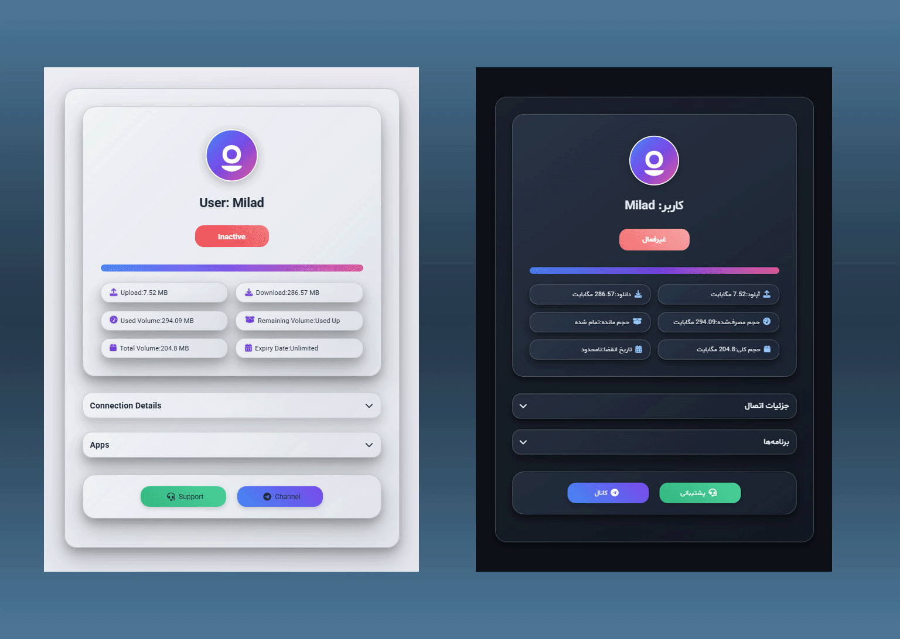

# ui-templates-prx11

<p align="center">
  <a href="https://github.com/dev-ir/xui-templates-blackeyes" target="_blank" rel="noopener noreferrer">
    
  </a>
</p>

## Important
Before Usage, make sure you have XUI-Subscription-Template installed.

<details>
  <summary>📺 Installation Tutorial</summary>
  <a href="https://www.youtube.com/watch?v=tUMck0_khRQ" target="_blank">
    پ
  </a>
</details>

## Usage

```bash
sudo git clone https://github.com/proxystore11/ui-templates-prx11.git /opt/DVHOST/views/templates/prx11/
sudo sed -i 's/^TEMPLATE_NAME=.*/TEMPLATE_NAME=prx11/' /opt/DVHOST/dvhost.config
```

# Remove Older Version
If you already have it installed, remove the previous version first.
```
rm -rf /opt/DVHOST/views/templates/prx11
```

<details>
  <summary>Click for configuration file manual</summary>

```
nano /opt/DVHOST/dvhost.config
```
## Template name 
```
# Replace Template name 
TEMPLATE_NAME=prx11
```
</details>

Now you can restart your XUI Panel Subscription Template:
```
systemctl restart DVHOST_TEMPLATE
systemctl status DVHOST_TEMPLATE
```
## نکته قبل استفاده
قبل از استفاده، مطمئن شوید که XUI-Subscription-Template را نصب کرده اید.


# استفاده

ابتدا فایل رو به سرور بفرستید. با دستور زیر میتونید این کارو بکنید:

```bash
sudo git clone https://github.com/proxystore11/ui-templates-prx11.git /opt/DVHOST/views/templates/prx11/
sudo sed -i 's/^TEMPLATE_NAME=.*/TEMPLATE_NAME=prx11/' /opt/DVHOST/dvhost.config
```

# حذف نسخه قبلی
اگر نسخه قبلی دارد ابتدا حذف سپس اقدام به نصب نمایید.
```
rm -rf /opt/DVHOST/views/templates/prx11
```

<details>
  <summary>📝 روش جایگزین: اضافه کردن مستقیم به فایل</summary>

سپس دستور زیر وارد کنید تا وارد تنظیمات اصلی شوید
```
nano /opt/DVHOST/dvhost.config
```

حالا میبایست نام پوسته جایگزین پوسته پیشفرض کنید
```
# Replace Template name 
TEMPLATE_NAME=prx11
```
</details>

حالا سرویس ری‌استارت کنید:
```
systemctl restart DVHOST_TEMPLATE
systemctl status DVHOST_TEMPLATE
```
*مشکلات،باگ ها را ایشو کنید*
## 🙏 Support with Crypto 
**We don't need financial support, only Star (⭐) is enough, thank you.**
- USDT (TRC20): ``

## 📧 Join Telegram Channel
TG: https://t.me/proxystore11


<a href="https://www.coffeebede.com/miladfaryad1"></a>
